<h1>
  
  KAlertDialog
</h1>


# KAlertDialog

**KAlertDialog** is a beautiful, modern, customizable Material-style AlertDialog library for Android.

It helps Android developers create professional dialogs such as success dialogs, error dialogs, warning dialogs, progress dialogs, input dialogs, custom image dialogs, URL image dialogs, and custom view dialogs with simple Java code.


[](https://snyk.io/test/github/TutorialsAndroid/KAlertDialog?targetFile=library%2Fbuild.gradle)
[](https://opensource.org/licenses/Apache-2.0)

---

## Latest Release

### Version `21.0.0`

Released on **21-05-2026**

### Changelog

- Added option to set font weight for title and content.
- Added modern style presets.
- Added dialog corner radius customization.
- Added dialog elevation customization.
- Added dialog dim amount customization.
- Added input validation support.
- Added input max length support.
- Added input type support.
- Added custom view dialog support.
- Added button text size customization.
- Added button font weight customization.
- Added button all-caps control.
- Added button icon support.
- Added URL image placeholder support.
- Added URL image error drawable support.
- Added progress shortcut methods.
- Added show and dismiss callback APIs.
- Added support for custom button drawables.
- Updated ProgressX library to latest version.
- Updated compileSdk and targetSdk to 37 across the project.
- Increased minSdkVersion to 23.
- Updated dependencies including Glide 5.0.7, Material 1.14.0, and AppCompat 1.7.1.
- Upgraded Gradle Wrapper to 9.4.1 and Android Gradle Plugin to 9.2.1.
- Refactored publishing configuration using modern `maven-publish`.
- Configured Java toolchain to version 17.
- Cleaned up Gradle properties and `.gitignore`.

---

## Important Notice

Older versions of this library have been removed.  
Please use the latest version of **KAlertDialog**.

Latest version is migrated to **AndroidX**.

---

## Follow

<p align="center">
Follow me on Instagram to stay up-to-date: https://instagram.com/coderx09
</p>

<p align="center">
Follow me on Twitter/X to stay up-to-date: https://twitter.com/a_masram444
</p>

---

## Contributors

Thanks to all contributors who helped improve this library.

- [NassB (Nassim B.)](https://github.com/NassB)
- [moisoni97 (Moisoni Ioan)](https://github.com/moisoni97)
- [paulocoutinhox (Paulo Coutinho)](https://github.com/paulocoutinhox)
- [SamarthaKV29 (Sam V)](https://github.com/SamarthaKV29)

---

## Features

- Material-style alert dialogs.
- Auto dark mode support.
- AndroidX support.
- Success dialog.
- Error dialog.
- Warning dialog.
- Normal message dialog.
- Progress/loading dialog.
- Input field dialog.
- Custom image dialog.
- URL image dialog.
- Custom view dialog.
- Modern style presets.
- Custom dialog corner radius.
- Custom dialog elevation.
- Custom dialog dim amount.
- Change title font.
- Change content font.
- Change button font.
- Change title font weight.
- Change content font weight.
- Change confirm button font weight.
- Change cancel button font weight.
- Change title text color.
- Change content text color.
- Change button text color.
- Change button background color.
- Add custom drawable background to confirm button.
- Add custom drawable background to cancel button.
- Add icons to confirm and cancel buttons.
- Control button text size.
- Control button all-caps behavior.
- Show vector drawable image with tint option in dark mode.
- Show custom image from URL.
- URL image circle crop support.
- URL image big image support.
- URL image placeholder support.
- URL image error drawable support.
- Change content text alignment.
- Change title layout alignment.
- Input validation support.
- Input max length support.
- Input type support.
- Progress helper support.
- Progress shortcut methods.
- Show and dismiss callback support.
- Dynamic alert type change.

---

## Screenshot Gallery

Below are some examples of dialogs created using **KAlertDialog**.

<p align="center">
  <table>
    <tr>
      <td align="center">
        <b>Modern Success Dialog</b><br><br>
        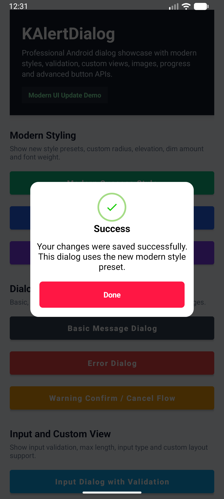
      </td>
      <td align="center">
        <b>Custom Radius, Elevation and Dim</b><br><br>
        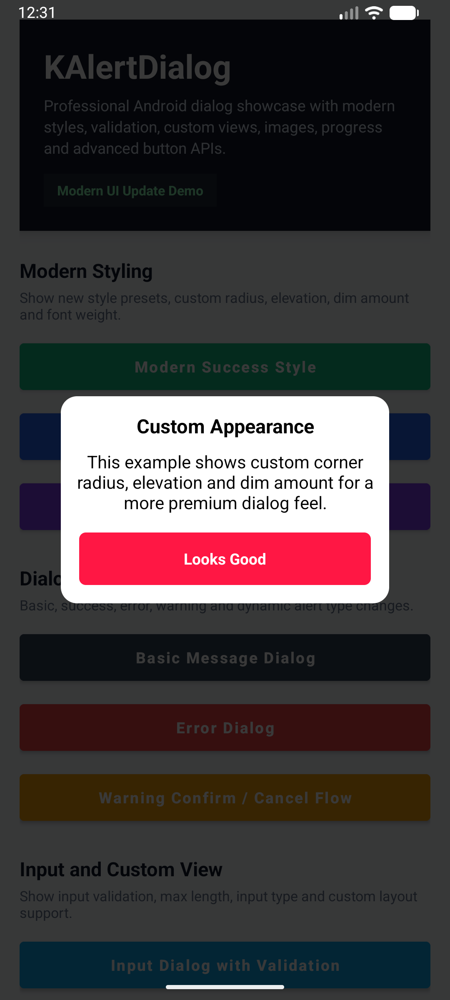
      </td>
      <td align="center">
        <b>Title and Content Font Weight</b><br><br>
        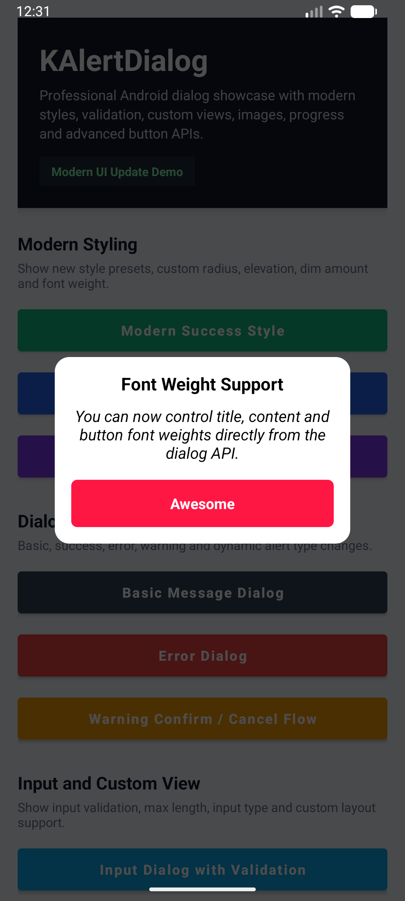
      </td>
    </tr>
    <tr>
      <td align="center">
        <b>Basic Message Dialog</b><br><br>
        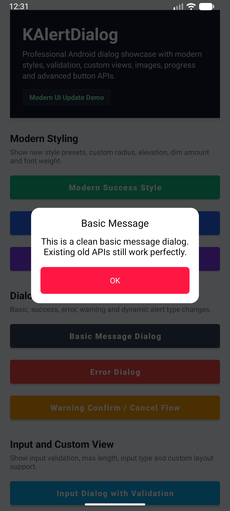
      </td>
      <td align="center">
        <b>Error Dialog</b><br><br>
        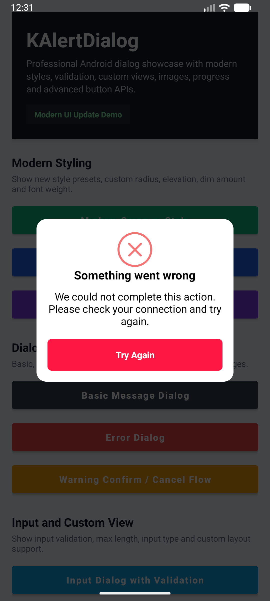
      </td>
      <td align="center">
        <b>Warning Confirm / Cancel Flow</b><br><br>
        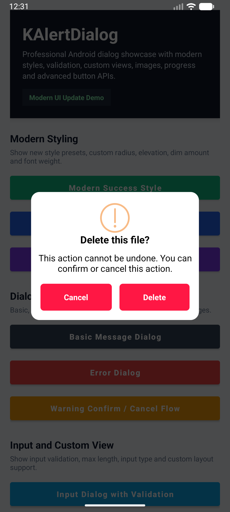
      </td>
    </tr>
    <tr>
      <td align="center">
        <b>Input Validation Dialog</b><br><br>
        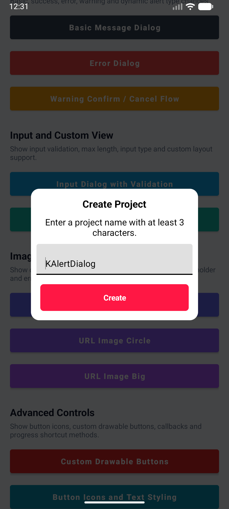
      </td>
      <td align="center">
        <b>Custom View Dialog</b><br><br>
        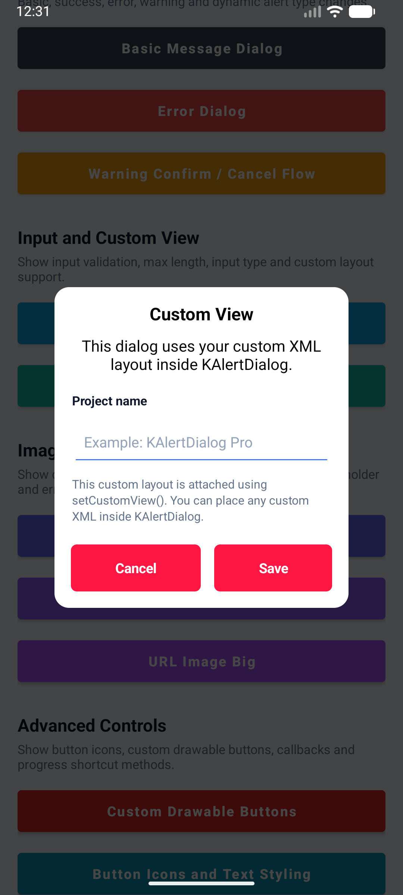
      </td>
    </tr>
    <tr>
      <td align="center">
        <b>Custom Icon Dialog</b><br><br>
        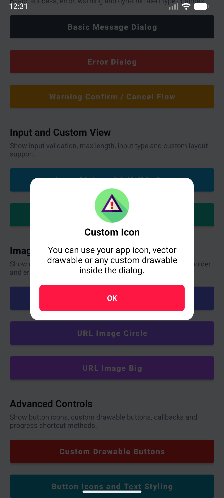
      </td>
      <td align="center">
        <b>URL Image Circle Dialog</b><br><br>
        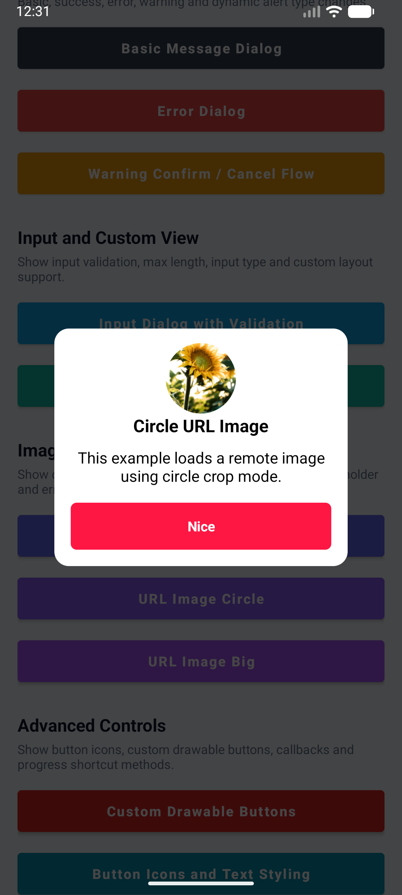
      </td>
      <td align="center">
        <b>Big URL Image Dialog</b><br><br>
        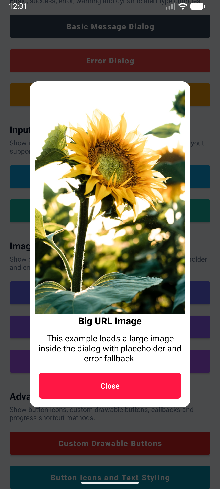
      </td>
    </tr>
    <tr>
      <td align="center">
        <b>Custom Button Drawable Dialog</b><br><br>
        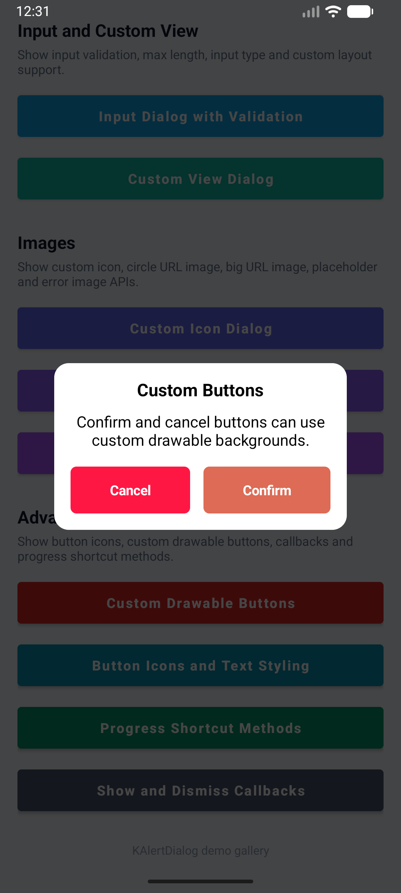
      </td>
      <td align="center">
        <b>Button Icon Styling Dialog</b><br><br>
        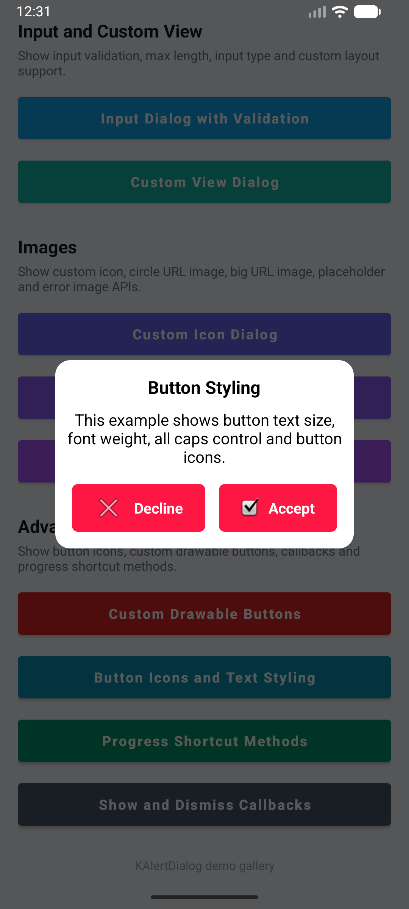
      </td>
      <td align="center">
        <b>Progress Shortcut Methods</b><br><br>
        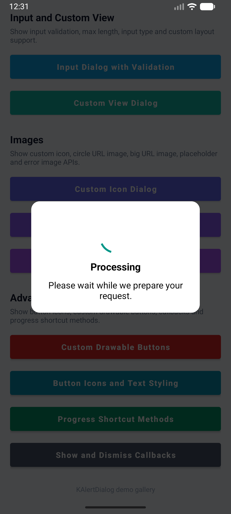
      </td>
      <td align="center">
        <b>Show and Dismiss Callbacks</b><br><br>
        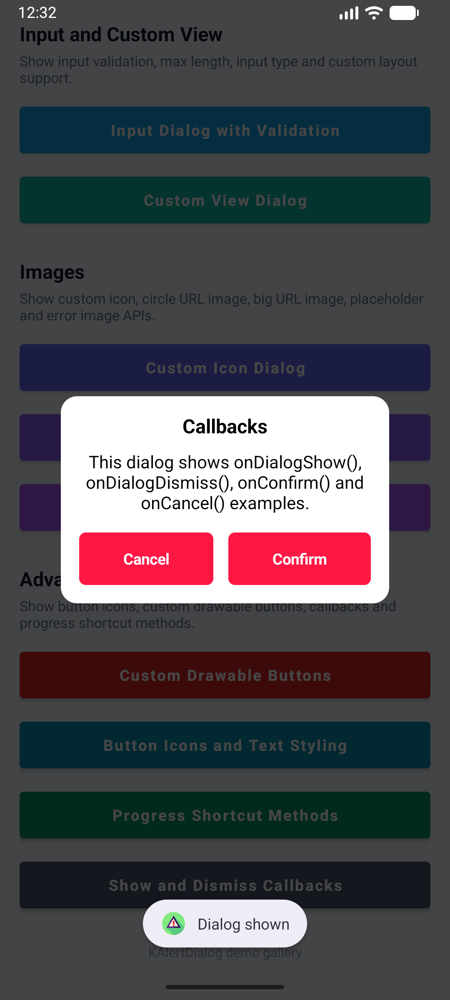
      </td>
    </tr>
  </table>
</p>

---

## Setup

The simplest way to use KAlertDialog is to add it as a dependency in your Android project.

---

## Gradle

### Step 1: Add repositories

For most modern Android projects, add this in `settings.gradle` or `settings.gradle.kts`.

#### Groovy

```gradle
dependencyResolutionManagement {
    repositoriesMode.set(RepositoriesMode.FAIL_ON_PROJECT_REPOS)
    repositories {
        google()
        mavenCentral()
        maven { url 'https://jitpack.io' }
    }
}
```

#### Kotlin DSL

```kotlin
dependencyResolutionManagement {
    repositoriesMode.set(RepositoriesMode.FAIL_ON_PROJECT_REPOS)
    repositories {
        google()
        mavenCentral()
        maven(url = "https://jitpack.io")
    }
}
```

For older projects, add this in your root `build.gradle`:

```gradle
allprojects {
    repositories {
        google()
        mavenCentral()
        maven { url 'https://jitpack.io' }
    }
}
```

---

### Step 2: Add dependencies

In your app-level `build.gradle`, add:

```gradle
dependencies {
    implementation 'io.github.tutorialsandroid:kalertdialog:21.0.0'
    implementation 'io.github.tutorialsandroid:progressx:7.0.5'
}
```

For Kotlin DSL:

```kotlin
dependencies {
    implementation("io.github.tutorialsandroid:kalertdialog:21.0.0")
    implementation("io.github.tutorialsandroid:progressx:7.0.5")
}
```

---

## Important: compileSdk Requirement

Starting from the latest versions of **KAlertDialog** and **ProgressX**, this library is built with the latest Android SDK.

If you are using:

```gradle
implementation 'io.github.tutorialsandroid:kalertdialog:21.0.0'
implementation 'io.github.tutorialsandroid:progressx:7.0.5'
```

your app must compile against **Android API 37 or higher**.

---

### Required configuration

In your app-level `build.gradle`, make sure your `compileSdk` is set to **37** or higher:

```gradle
android {
    compileSdk 37

    defaultConfig {
        minSdk 23
        targetSdk 36
    }
}
```

For Kotlin DSL:

```kotlin
android {
    compileSdk = 37

    defaultConfig {
        minSdk = 23
        targetSdk = 36
    }
}
```

---

### Why is this required?

If your project is using an older `compileSdk`, for example:

```gradle
compileSdk 36
```

you may see an error like this:

```txt
Dependency 'io.github.tutorialsandroid:kalertdialog:21.0.0' requires libraries and applications
that depend on it to compile against version 37 or later of the Android APIs.

:app is currently compiled against android-36.1.
```

This happens because the latest version of KAlertDialog and ProgressX is compiled with **Android API 37**.

---

### Important note

Updating `compileSdk` is safe and different from updating `targetSdk` or `minSdk`.

- `compileSdk` allows your app to compile with the latest Android APIs.
- `targetSdk` controls which Android runtime behavior changes your app opts into.
- `minSdk` controls the minimum Android version your app can be installed on.

So you can update only `compileSdk` to 37 while keeping your existing `targetSdk` and `minSdk`.

---

### Solution

Update your app-level Gradle file:

```gradle
android {
    compileSdk 37
}
```

Then sync the project again in Android Studio.

If Android Studio asks to install Android API 37, install it from:

```txt
Tools > SDK Manager > Android SDK
```

After updating `compileSdk`, the AAR metadata error should be resolved.

---

## Basic Usage

### Basic message

```java
new KAlertDialog(this)
        .setTitleText("Here's a message!")
        .show();
```

---

### Title with content text

```java
new KAlertDialog(this)
        .setTitleText("Here's a message!")
        .setContentText("It's pretty, isn't it?")
        .show();
```

---

### Normal dialog with confirm button

```java
new KAlertDialog(this, KAlertDialog.NORMAL_TYPE, true)
        .setTitleText("KAlertDialog")
        .setContentText("This is a clean and modern alert dialog.")
        .setConfirmClickListener("OK", null)
        .show();
```

---

## Dialog Types

KAlertDialog supports multiple dialog types:

```java
KAlertDialog.NORMAL_TYPE
KAlertDialog.ERROR_TYPE
KAlertDialog.SUCCESS_TYPE
KAlertDialog.WARNING_TYPE
KAlertDialog.CUSTOM_IMAGE_TYPE
KAlertDialog.URL_IMAGE_TYPE
KAlertDialog.PROGRESS_TYPE
KAlertDialog.INPUT_TYPE
KAlertDialog.CUSTOM_VIEW_TYPE
```

---

## Success Dialog

```java
new KAlertDialog(this, KAlertDialog.SUCCESS_TYPE, true)
        .setTitleText("Good job!")
        .setContentText("You clicked the button!")
        .setConfirmClickListener("OK", null)
        .show();
```

---

## Error Dialog

```java
new KAlertDialog(this, KAlertDialog.ERROR_TYPE, true)
        .setTitleText("Oops...")
        .setContentText("Something went wrong!")
        .setConfirmClickListener("Try Again", null)
        .show();
```

---

## Warning Dialog

```java
new KAlertDialog(this, KAlertDialog.WARNING_TYPE, true)
        .setTitleText("Are you sure?")
        .setContentText("You won't be able to recover this file!")
        .setConfirmClickListener("Yes, delete it!", null)
        .show();
```

---

## Warning Dialog with Confirm and Cancel Listeners

```java
new KAlertDialog(this, KAlertDialog.WARNING_TYPE, true)
        .setTitleText("Are you sure?")
        .setContentText("You won't be able to recover this file!")
        .showCancelButton(true)
        .setCancelClickListener("Cancel", dialog -> {
            dialog.setTitleText("Cancelled")
                    .setContentText("Your file is safe.")
                    .showCancelButton(false)
                    .setConfirmClickListener("OK", null)
                    .changeAlertType(KAlertDialog.ERROR_TYPE);
        })
        .setConfirmClickListener("Delete", dialog -> {
            dialog.setTitleText("Deleted")
                    .setContentText("Your file has been deleted.")
                    .showCancelButton(false)
                    .setConfirmClickListener("OK", null)
                    .changeAlertType(KAlertDialog.SUCCESS_TYPE);
        })
        .show();
```

---

## Modern Style Presets

KAlertDialog includes built-in style presets.

```java
KAlertDialog.STYLE_CLASSIC
KAlertDialog.STYLE_MODERN
KAlertDialog.STYLE_MINIMAL
KAlertDialog.STYLE_ROUNDED
```

### Modern style example

```java
new KAlertDialog(this, KAlertDialog.SUCCESS_TYPE, true)
        .setTitleText("Success")
        .setContentText("Your changes were saved successfully.")
        .applyStyle(KAlertDialog.STYLE_MODERN)
        .setConfirmClickListener("Done", dialog -> dialog.dismissWithAnimation())
        .show();
```

### Rounded style example

```java
new KAlertDialog(this, KAlertDialog.WARNING_TYPE, true)
        .setTitleText("Delete this file?")
        .setContentText("This action cannot be undone.")
        .applyStyle(KAlertDialog.STYLE_ROUNDED)
        .showCancelButton(true)
        .setCancelClickListener("Cancel", null)
        .setConfirmClickListener("Delete", null)
        .show();
```

---

## Custom Dialog Appearance

You can customize the dialog background, corner radius, elevation, and dim amount.

```java
new KAlertDialog(this, KAlertDialog.NORMAL_TYPE, true)
        .setTitleText("Custom Appearance")
        .setContentText("This dialog has custom radius, elevation and dim amount.")
        .setDialogCornerRadius(30)
        .setDialogElevation(14)
        .setDimAmount(0.55f)
        .setConfirmClickListener("Looks Good", null)
        .show();
```

Available methods:

```java
.setDialogBackgroundColor(Color.WHITE)
.setDialogBackgroundColorResource(R.color.white)
.setDialogCornerRadius(30)
.setDialogElevation(14)
.setDimAmount(0.55f)
```

---

## Progress Dialog

### Basic progress dialog

```java
KAlertDialog pDialog = new KAlertDialog(this, KAlertDialog.PROGRESS_TYPE, true);
pDialog.setTitleText("Loading");
pDialog.setCancelable(false);
pDialog.show();
```

---

### Progress dialog with helper

```java
KAlertDialog pDialog = new KAlertDialog(this, KAlertDialog.PROGRESS_TYPE, true);
pDialog.getProgressHelper().setBarColor(Color.parseColor("#A5DC86"));
pDialog.setTitleText("Loading");
pDialog.setCancelable(false);
pDialog.show();
```

You can customize the progress bar dynamically using:

```java
pDialog.getProgressHelper().resetCount();
pDialog.getProgressHelper().isSpinning();
pDialog.getProgressHelper().spin();
pDialog.getProgressHelper().stopSpinning();
pDialog.getProgressHelper().getProgress();
pDialog.getProgressHelper().setProgress(0.5f);
pDialog.getProgressHelper().setInstantProgress(0.5f);
pDialog.getProgressHelper().getCircleRadius();
pDialog.getProgressHelper().setCircleRadius(80);
pDialog.getProgressHelper().getBarWidth();
pDialog.getProgressHelper().setBarWidth(6);
pDialog.getProgressHelper().getBarColor();
pDialog.getProgressHelper().setBarColor(Color.GREEN);
pDialog.getProgressHelper().getRimWidth();
pDialog.getProgressHelper().setRimWidth(2);
pDialog.getProgressHelper().getRimColor();
pDialog.getProgressHelper().setRimColor(Color.LTGRAY);
pDialog.getProgressHelper().getSpinSpeed();
pDialog.getProgressHelper().setSpinSpeed(1.0f);
```

---

### Progress shortcut methods

Latest versions also support direct shortcut methods:

```java
new KAlertDialog(this, KAlertDialog.PROGRESS_TYPE, true)
        .setTitleText("Processing")
        .setContentText("Please wait while we prepare your request.")
        .applyStyle(KAlertDialog.STYLE_MODERN)
        .setProgressColor(Color.parseColor("#10B981"))
        .setProgressSpinSpeed(1.1f)
        .show();
```

Available progress shortcut methods:

```java
.setProgressColor(Color.GREEN)
.setProgressColorResource(R.color.success_stroke_color)
.setProgressWidth(6)
.setProgressValue(0.5f)
.setProgressInstantValue(0.5f)
.setProgressSpinSpeed(1.1f)
.setProgressCircleRadius(80)
```

---

## Input Field Dialog

### Basic input dialog

```java
KAlertDialog dialog = new KAlertDialog(this, KAlertDialog.INPUT_TYPE, true);

dialog.setTitleText("Edit Text");
dialog.setInputFieldHint("Write message");
dialog.setInputFieldText("Hello World!");
dialog.setConfirmClickListener("OK", kAlertDialog -> {
    kAlertDialog.dismissWithAnimation();
    String inputText = kAlertDialog.getInputText();
    Toast.makeText(this, inputText, Toast.LENGTH_SHORT).show();
});

dialog.show();
```

---

### Input dialog with validation

```java
new KAlertDialog(this, KAlertDialog.INPUT_TYPE, true)
        .setTitleText("Create Project")
        .setContentText("Enter a project name with at least 3 characters.")
        .applyStyle(KAlertDialog.STYLE_MODERN)
        .setInputFieldHint("Project name")
        .setInputFieldText("KAlertDialog")
        .setInputType(InputType.TYPE_CLASS_TEXT | InputType.TYPE_TEXT_FLAG_CAP_WORDS)
        .setInputMaxLength(30)
        .setInputError("Project name must be at least 3 characters")
        .setInputValidator(input -> input != null && input.trim().length() >= 3)
        .setOnInputConfirmListener((dialog, input) -> {
            dialog.dismissWithAnimation();
            Toast.makeText(this, "Created: " + input.trim(), Toast.LENGTH_SHORT).show();
        })
        .setConfirmClickListener("Create", null)
        .show();
```

Available input methods:

```java
.setInputFieldHint("Project name")
.setInputFieldText("KAlertDialog")
.setInputType(InputType.TYPE_CLASS_TEXT)
.setInputMaxLength(30)
.setInputError("Invalid input")
.setInputValidator(input -> input.trim().length() >= 3)
.setOnInputConfirmListener((dialog, input) -> { })
.getInputText()
```

---

## Custom View Dialog

You can add your own custom XML layout inside KAlertDialog.

```java
KAlertDialog dialog = new KAlertDialog(this, KAlertDialog.CUSTOM_VIEW_TYPE, true)
        .setTitleText("Custom View")
        .setContentText("This dialog uses your custom XML layout.")
        .applyStyle(KAlertDialog.STYLE_MODERN)
        .setCustomView(R.layout.customedittext)
        .showCancelButton(true)
        .setCancelClickListener("Cancel", kAlertDialog -> kAlertDialog.dismissWithAnimation());

dialog.setConfirmClickListener("Save", kAlertDialog -> {
    View customView = kAlertDialog.getCustomView();

    if (customView == null) {
        return;
    }

    EditText editText = customView.findViewById(R.id.edit_query);
    String value = editText.getText().toString().trim();

    if (value.length() < 3) {
        editText.setError("Please enter at least 3 characters");
        return;
    }

    kAlertDialog.dismissWithAnimation();
    Toast.makeText(this, "Saved: " + value, Toast.LENGTH_SHORT).show();
});

dialog.show();
```

Available custom view methods:

```java
.setCustomView(R.layout.custom_layout)
.setCustomView(view)
.getCustomView()
```

---

## Custom Image Dialog

```java
new KAlertDialog(this, KAlertDialog.CUSTOM_IMAGE_TYPE, true)
        .setTitleText("Sweet!")
        .setContentText("Here's a custom image.")
        .setCustomImage(R.drawable.custom_img)
        .setConfirmClickListener("OK", null)
        .show();
```

---

## Vector Drawable Tint in Dark Mode

```java
new KAlertDialog(this, KAlertDialog.CUSTOM_IMAGE_TYPE, true)
        .setTitleText("Sweet!")
        .setContentText("Here's a custom vector image.")
        .setCustomImage(R.drawable.vector_drawable)
        .setDrawableTintOnNightMode(true, R.color.white)
        .setConfirmClickListener("OK", null)
        .show();
```

---

## URL Image Dialog

KAlertDialog supports URL image dialogs with two display types:

```java
KAlertDialog.IMAGE_BIG
KAlertDialog.IMAGE_CIRCLE
```

---

### Circle URL image

```java
new KAlertDialog(this, KAlertDialog.URL_IMAGE_TYPE, true)
        .setTitleText("Circle URL Image")
        .setContentText("This image is loaded from a URL using circle crop mode.")
        .applyStyle(KAlertDialog.STYLE_MODERN)
        .setURLImagePlaceholder(R.mipmap.ic_launcher)
        .setURLImageError(R.mipmap.ic_launcher)
        .setURLImage("https://example.com/image.png", KAlertDialog.IMAGE_CIRCLE)
        .setConfirmClickListener("Nice", null)
        .show();
```

---

### Big URL image

```java
new KAlertDialog(this, KAlertDialog.URL_IMAGE_TYPE, true)
        .setTitleText("Big URL Image")
        .setContentText("This image is loaded from a URL as a large image.")
        .applyStyle(KAlertDialog.STYLE_ROUNDED)
        .setURLImagePlaceholder(R.mipmap.ic_launcher)
        .setURLImageError(R.mipmap.ic_launcher)
        .setURLImage("https://example.com/image.png", KAlertDialog.IMAGE_BIG)
        .setConfirmClickListener("Close", null)
        .show();
```

Available URL image methods:

```java
.setURLImage("https://example.com/image.png", KAlertDialog.IMAGE_CIRCLE)
.setURLImage("https://example.com/image.png", KAlertDialog.IMAGE_BIG)
.setURLImagePlaceholder(R.drawable.placeholder)
.setURLImageError(R.drawable.image_error)
```

---

## Font Customization

### Change title font from assets

Place your font file in:

```txt
app/src/main/assets/fonts/
```

Then use:

```java
new KAlertDialog(this, KAlertDialog.NORMAL_TYPE, true)
        .setTitleText("Custom Font")
        .setTitleFontAssets("fonts/os.ttf")
        .setContentText("The title uses a custom font from assets.")
        .setConfirmClickListener("OK", null)
        .show();
```

---

### Change content font from assets

```java
new KAlertDialog(this, KAlertDialog.NORMAL_TYPE, true)
        .setTitleText("Custom Font")
        .setContentText("The content uses a custom font from assets.")
        .setContentFontAssets("fonts/poppins_regular.ttf")
        .setConfirmClickListener("OK", null)
        .show();
```

---

### Change font from `res/font`

You can also place font files inside:

```txt
app/src/main/res/font/
```

Then use:

```java
new KAlertDialog(this, KAlertDialog.NORMAL_TYPE, true)
        .setTitleText("Custom Font")
        .setContentText("The content uses a font from res/font.")
        .setContentFont(R.font.sf)
        .setConfirmClickListener("OK", null)
        .show();
```

---

## Font Weight

You can change title and content font weight.

```java
new KAlertDialog(this, KAlertDialog.NORMAL_TYPE, true)
        .setTitleText("Font Weight")
        .setContentText("Title is bold and content is italic.")
        .setTitleFontWeight(Typeface.BOLD)
        .setContentFontWeight(Typeface.ITALIC)
        .setConfirmClickListener("OK", null)
        .show();
```

Available values:

```java
Typeface.NORMAL
Typeface.BOLD
Typeface.ITALIC
Typeface.BOLD_ITALIC
```

---

## Text Color

```java
new KAlertDialog(this, KAlertDialog.NORMAL_TYPE, true)
        .setTitleText("Custom Colors")
        .setContentText("Title and content colors can be customized.")
        .setTitleColor(R.color.your_title_color)
        .setContentColor(R.color.your_content_color)
        .setConfirmClickListener("OK", null)
        .show();
```

---

## Text Size

```java
new KAlertDialog(this, KAlertDialog.NORMAL_TYPE, true)
        .setTitleText("Text Size")
        .setContentText("You can customize title and content text size.")
        .setTitleTextSize(20)
        .setContentTextSize(16)
        .setConfirmClickListener("OK", null)
        .show();
```

---

## Text Alignment

### Content align start

```java
new KAlertDialog(this, KAlertDialog.NORMAL_TYPE, true)
        .setTitleText("Text Alignment")
        .setContentText("This content is aligned to the start.")
        .setContentTextAlignment(View.TEXT_ALIGNMENT_VIEW_START, Gravity.START)
        .setConfirmClickListener("OK", null)
        .show();
```

---

### Content align center

```java
new KAlertDialog(this, KAlertDialog.NORMAL_TYPE, true)
        .setTitleText("Text Alignment")
        .setContentText("This content is centered.")
        .setContentTextAlignment(View.TEXT_ALIGNMENT_CENTER, Gravity.CENTER)
        .setConfirmClickListener("OK", null)
        .show();
```

---

### Title layout gravity

```java
new KAlertDialog(this, KAlertDialog.NORMAL_TYPE, true)
        .setTitleText("Start Title")
        .setTitleTextLayoutGravity(Gravity.START)
        .setContentText("The title layout gravity is set to start.")
        .setConfirmClickListener("OK", null)
        .show();
```

---

## Button Customization

### Change confirm and cancel button background using drawable

```java
new KAlertDialog(this, KAlertDialog.NORMAL_TYPE, true)
        .setTitleText("Custom Buttons")
        .setContentText("Confirm and cancel buttons can use custom drawable backgrounds.")
        .showCancelButton(true)
        .setConfirmClickListener("Confirm", null)
        .setCancelClickListener("Cancel", null)
        .confirmButtonDrawable(R.drawable.red_button_background)
        .cancelButtonDrawable(R.drawable.button_background)
        .show();
```

Example drawable:

```xml
<?xml version="1.0" encoding="utf-8"?>
<selector xmlns:android="http://schemas.android.com/apk/res/android">
    <item android:state_pressed="true">
        <shape android:shape="rectangle">
            <solid android:color="#FF5474" />
            <corners android:radius="6dp" />
        </shape>
    </item>

    <item>
        <shape android:shape="rectangle">
            <solid android:color="#FF1744" />
            <corners android:radius="6dp" />
        </shape>
    </item>
</selector>
```

---

### Change button text color

```java
new KAlertDialog(this, KAlertDialog.NORMAL_TYPE, true)
        .setTitleText("Button Text Color")
        .setContentText("Button text colors can be customized.")
        .setConfirmClickListener("OK", R.color.black, null)
        .showCancelButton(true)
        .setCancelClickListener("Cancel", R.color.black, null)
        .show();
```

---

### Change button font weight, text size, all caps and icons

```java
new KAlertDialog(this, KAlertDialog.NORMAL_TYPE, true)
        .setTitleText("Button Styling")
        .setContentText("This example shows button text size, font weight, all caps control and button icons.")
        .applyStyle(KAlertDialog.STYLE_MINIMAL)
        .showCancelButton(true)
        .setConfirmButtonTextSize(15)
        .setCancelButtonTextSize(15)
        .setConfirmButtonFontWeight(Typeface.BOLD)
        .setCancelButtonFontWeight(Typeface.BOLD)
        .setConfirmButtonAllCaps(false)
        .setCancelButtonAllCaps(false)
        .setConfirmButtonIcon(android.R.drawable.checkbox_on_background)
        .setCancelButtonIcon(android.R.drawable.ic_menu_close_clear_cancel)
        .setConfirmClickListener("Accept", dialog -> dialog.dismissWithAnimation())
        .setCancelClickListener("Decline", dialog -> dialog.dismissWithAnimation())
        .show();
```

Available button methods:

```java
.setConfirmButtonTextSize(15)
.setCancelButtonTextSize(15)
.setConfirmButtonFontWeight(Typeface.BOLD)
.setCancelButtonFontWeight(Typeface.BOLD)
.setConfirmButtonAllCaps(false)
.setCancelButtonAllCaps(false)
.setConfirmButtonIcon(R.drawable.ic_done)
.setCancelButtonIcon(R.drawable.ic_close)
.confirmButtonDrawable(R.drawable.confirm_background)
.cancelButtonDrawable(R.drawable.cancel_background)
.confirmButtonColor(R.color.colorPrimary)
.cancelButtonColor(R.color.colorAccent)
```

---

## Show or Hide Buttons

### Hide confirm button

```java
new KAlertDialog(this, KAlertDialog.NORMAL_TYPE, true)
        .setTitleText("No Confirm Button")
        .setContentText("The confirm button is hidden.")
        .showConfirmButton(false)
        .show();
```

---

### Hide cancel button

```java
new KAlertDialog(this, KAlertDialog.NORMAL_TYPE, true)
        .setTitleText("No Cancel Button")
        .setContentText("The cancel button is hidden.")
        .showCancelButton(false)
        .setConfirmClickListener("OK", null)
        .show();
```

---

### Hide both buttons

```java
new KAlertDialog(this, KAlertDialog.CUSTOM_IMAGE_TYPE, true)
        .setTitleText("Custom Image")
        .setContentText("Both buttons are hidden.")
        .setCustomImage(R.drawable.custom_img)
        .showConfirmButton(false)
        .showCancelButton(false)
        .show();
```

---

## Modern Listener APIs

Latest versions support modern callback-style methods.

```java
new KAlertDialog(this, KAlertDialog.NORMAL_TYPE, true)
        .setTitleText("Callbacks")
        .setContentText("This dialog shows modern listener APIs.")
        .applyStyle(KAlertDialog.STYLE_MODERN)
        .showCancelButton(true)
        .onDialogShow(dialog -> {
            Toast.makeText(this, "Dialog shown", Toast.LENGTH_SHORT).show();
        })
        .onDialogDismiss(dialog -> {
            Toast.makeText(this, "Dialog dismissed", Toast.LENGTH_SHORT).show();
        })
        .onConfirm(dialog -> {
            Toast.makeText(this, "Confirmed", Toast.LENGTH_SHORT).show();
            dialog.dismissWithAnimation();
        })
        .onCancel(dialog -> {
            Toast.makeText(this, "Cancelled", Toast.LENGTH_SHORT).show();
            dialog.dismissWithAnimation();
        })
        .setConfirmClickListener("Confirm", null)
        .setCancelClickListener("Cancel", null)
        .show();
```

Available callback methods:

```java
.onConfirm(dialog -> { })
.onCancel(dialog -> { })
.onDialogShow(dialog -> { })
.onDialogDismiss(dialog -> { })
```

---

## Dynamic Alert Type Change

You can change the dialog type after a user action.

```java
new KAlertDialog(this, KAlertDialog.WARNING_TYPE, true)
        .setTitleText("Are you sure?")
        .setContentText("You won't be able to recover this file!")
        .showCancelButton(true)
        .setCancelClickListener("Cancel", dialog -> {
            dialog.setTitleText("Cancelled")
                    .setContentText("Your file is safe.")
                    .showCancelButton(false)
                    .setConfirmClickListener("OK", null)
                    .changeAlertType(KAlertDialog.ERROR_TYPE);
        })
        .setConfirmClickListener("Delete", dialog -> {
            dialog.setTitleText("Deleted")
                    .setContentText("Your file has been deleted.")
                    .showCancelButton(false)
                    .setConfirmClickListener("OK", null)
                    .changeAlertType(KAlertDialog.SUCCESS_TYPE);
        })
        .show();
```

---

## HTML in Title and Content

You can use basic HTML in title and content text.

```java
new KAlertDialog(this, KAlertDialog.NORMAL_TYPE, true)
        .setTitleText("<b>Important</b>")
        .setContentText("<p>This is an <b>HTML</b> content message.</p>")
        .setConfirmClickListener("OK", null)
        .show();
```

---

## Auto Dark Mode

Pass `true` in the constructor to enable auto night mode support.

```java
new KAlertDialog(this, KAlertDialog.SUCCESS_TYPE, true)
        .setTitleText("Dark Mode Supported")
        .setContentText("This dialog automatically adapts when your app is in night mode.")
        .setConfirmClickListener("OK", null)
        .show();
```

---

## Sample App

The sample app demonstrates:

- Modern style preset.
- Custom dialog appearance.
- Font weight.
- Basic dialog.
- Success dialog.
- Error dialog.
- Warning confirm/cancel flow.
- Input validation.
- Custom view.
- Custom icon.
- URL circle image.
- URL big image.
- Custom drawable buttons.
- Button icon and text styling.
- Progress shortcut methods.
- Show and dismiss callbacks.

---

## Common Issues

### AAR metadata error

If you see:

```txt
Dependency 'io.github.tutorialsandroid:kalertdialog:21.0.0' requires libraries and applications
that depend on it to compile against version 37 or later of the Android APIs.
```

Update your app-level Gradle file:

```gradle
android {
    compileSdk 37
}
```

Then sync your project.

---

### Big URL image appears small

If the big image appears small, make sure your `alert_dialog.xml` gives `custom_big_image` a proper fixed height and its parent has `match_parent` width.

Recommended XML:

```xml
<FrameLayout
    android:id="@+id/custom_image_frame"
    android:layout_width="match_parent"
    android:layout_height="wrap_content"
    android:layout_marginTop="5dp"
    android:gravity="center">

    <ImageView
        android:id="@+id/custom_big_image"
        android:layout_width="match_parent"
        android:layout_height="170dp"
        android:layout_gravity="center"
        android:adjustViewBounds="true"
        android:visibility="gone"
        android:scaleType="centerCrop" />

</FrameLayout>
```

Also use `centerCrop()` in Glide for `IMAGE_BIG`.

---

### Input keyboard not showing

For the latest version, the library handles keyboard visibility internally.

Use:

```java
new KAlertDialog(this, KAlertDialog.INPUT_TYPE, true)
        .setTitleText("Input")
        .setInputFieldHint("Write message")
        .setConfirmClickListener("OK", null)
        .show();
```

---

## API Summary

### Constructors

```java
new KAlertDialog(context)
new KAlertDialog(context, autoNightMode)
new KAlertDialog(context, alertType, autoNightMode)
```

---

### Dialog types

```java
KAlertDialog.NORMAL_TYPE
KAlertDialog.ERROR_TYPE
KAlertDialog.SUCCESS_TYPE
KAlertDialog.WARNING_TYPE
KAlertDialog.CUSTOM_IMAGE_TYPE
KAlertDialog.URL_IMAGE_TYPE
KAlertDialog.PROGRESS_TYPE
KAlertDialog.INPUT_TYPE
KAlertDialog.CUSTOM_VIEW_TYPE
```

---

### Style presets

```java
KAlertDialog.STYLE_CLASSIC
KAlertDialog.STYLE_MODERN
KAlertDialog.STYLE_MINIMAL
KAlertDialog.STYLE_ROUNDED
```

---

### Image display types

```java
KAlertDialog.IMAGE_BIG
KAlertDialog.IMAGE_CIRCLE
```

---

### Text methods

```java
.setTitleText("Title")
.setContentText("Content")
.setTitleTextSize(20)
.setContentTextSize(16)
.setTitleColor(R.color.color)
.setContentColor(R.color.color)
.setTitleFont(R.font.font_name)
.setContentFont(R.font.font_name)
.setTitleFontAssets("fonts/font.ttf")
.setContentFontAssets("fonts/font.ttf")
.setTitleFontWeight(Typeface.BOLD)
.setContentFontWeight(Typeface.NORMAL)
.setTitleTextLayoutGravity(Gravity.START)
.setTitleTextGravity(Gravity.CENTER)
.setContentTextAlignment(View.TEXT_ALIGNMENT_CENTER, Gravity.CENTER)
```

---

### Button methods

```java
.setConfirmClickListener("OK", listener)
.setCancelClickListener("Cancel", listener)
.showConfirmButton(true)
.showCancelButton(true)
.confirmButtonColor(R.color.color)
.cancelButtonColor(R.color.color)
.confirmButtonDrawable(R.drawable.drawable)
.cancelButtonDrawable(R.drawable.drawable)
.setConfirmButtonTextSize(15)
.setCancelButtonTextSize(15)
.setConfirmButtonFontWeight(Typeface.BOLD)
.setCancelButtonFontWeight(Typeface.BOLD)
.setConfirmButtonAllCaps(false)
.setCancelButtonAllCaps(false)
.setConfirmButtonIcon(R.drawable.icon)
.setCancelButtonIcon(R.drawable.icon)
```

---

### Input methods

```java
.setInputFieldHint("Hint")
.setInputFieldText("Default text")
.setInputType(InputType.TYPE_CLASS_TEXT)
.setInputMaxLength(30)
.setInputError("Error message")
.setInputValidator(input -> input.trim().length() >= 3)
.setOnInputConfirmListener((dialog, input) -> { })
.getInputText()
```

---

### Custom view methods

```java
.setCustomView(R.layout.custom_layout)
.setCustomView(view)
.getCustomView()
```

---

### URL image methods

```java
.setURLImage("https://example.com/image.png", KAlertDialog.IMAGE_CIRCLE)
.setURLImage("https://example.com/image.png", KAlertDialog.IMAGE_BIG)
.setURLImagePlaceholder(R.drawable.placeholder)
.setURLImageError(R.drawable.error_image)
```

---

### Progress methods

```java
.getProgressHelper()
.setProgressColor(Color.GREEN)
.setProgressColorResource(R.color.color)
.setProgressWidth(6)
.setProgressValue(0.5f)
.setProgressInstantValue(0.5f)
.setProgressSpinSpeed(1.1f)
.setProgressCircleRadius(80)
```

---

### Dialog appearance methods

```java
.applyStyle(KAlertDialog.STYLE_MODERN)
.setDialogBackgroundColor(Color.WHITE)
.setDialogBackgroundColorResource(R.color.white)
.setDialogCornerRadius(30)
.setDialogElevation(14)
.setDimAmount(0.55f)
```

---

### Callback methods

```java
.onConfirm(dialog -> { })
.onCancel(dialog -> { })
.onDialogShow(dialog -> { })
.onDialogDismiss(dialog -> { })
```

---

## License

Apache License 2.0

```txt
Copyright 2019 KAlertDialog

Licensed under the Apache License, Version 2.0 (the "License");
you may not use this file except in compliance with the License.
You may obtain a copy of the License at

 http://www.apache.org/licenses/LICENSE-2.0

Unless required by applicable law or agreed to in writing, software
distributed under the License is distributed on an "AS IS" BASIS,
WITHOUT WARRANTIES OR CONDITIONS OF ANY KIND, either express or implied.
See the License for the specific language governing permissions and
limitations under the License.
```